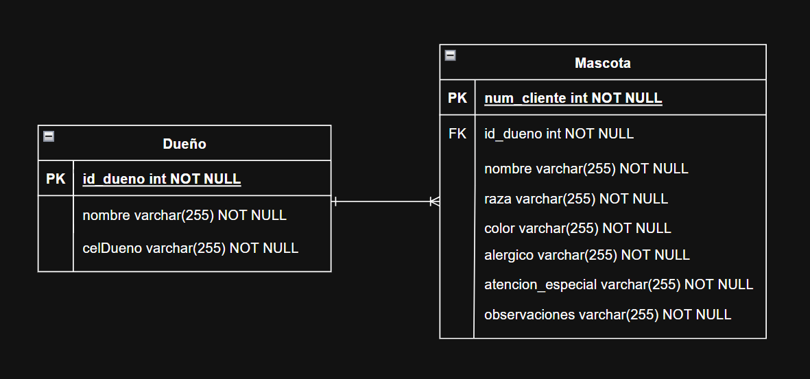
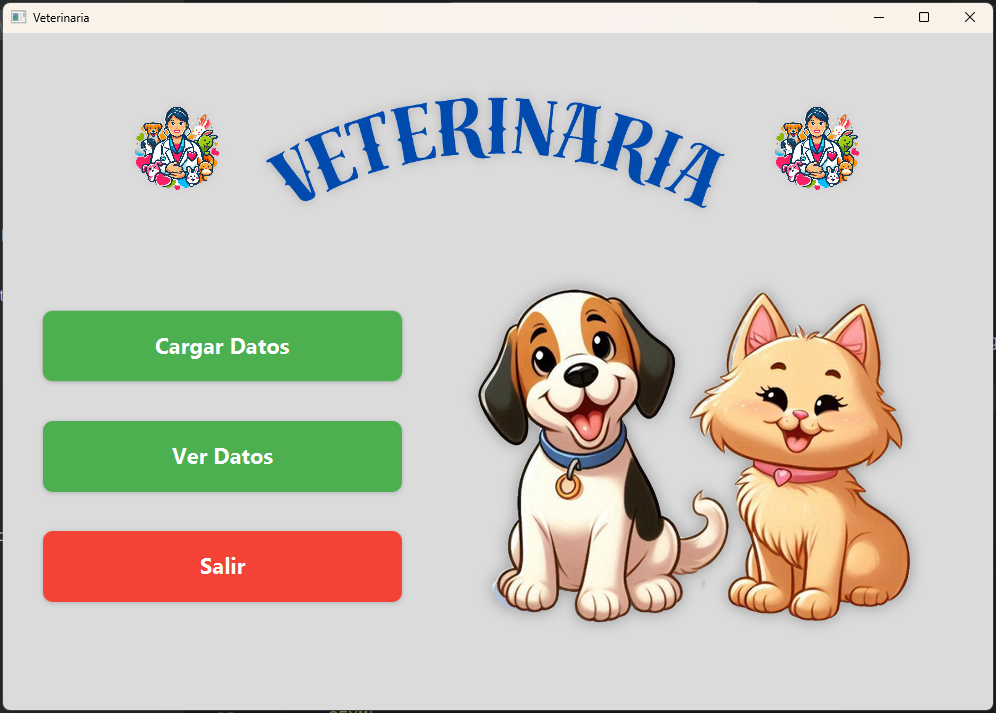
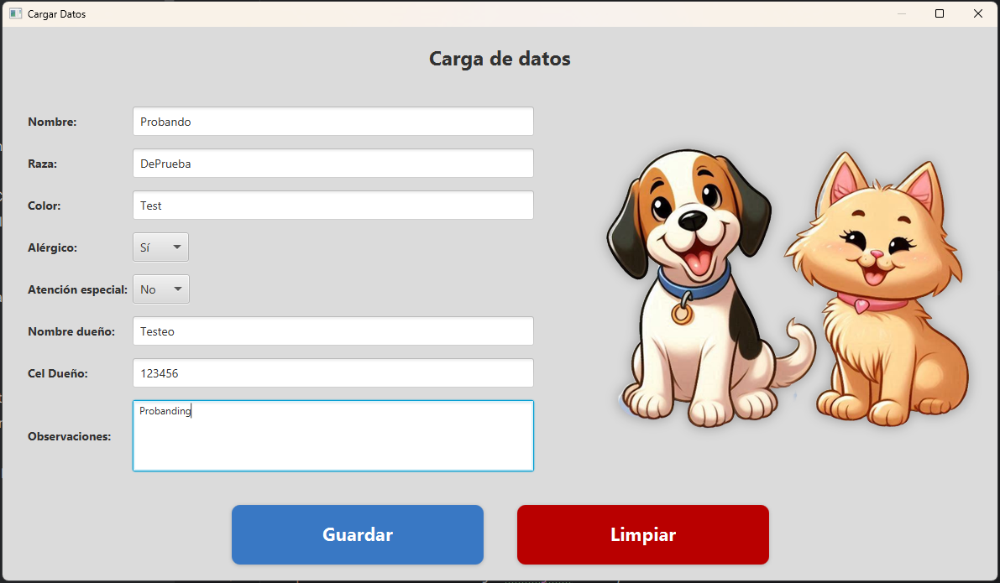
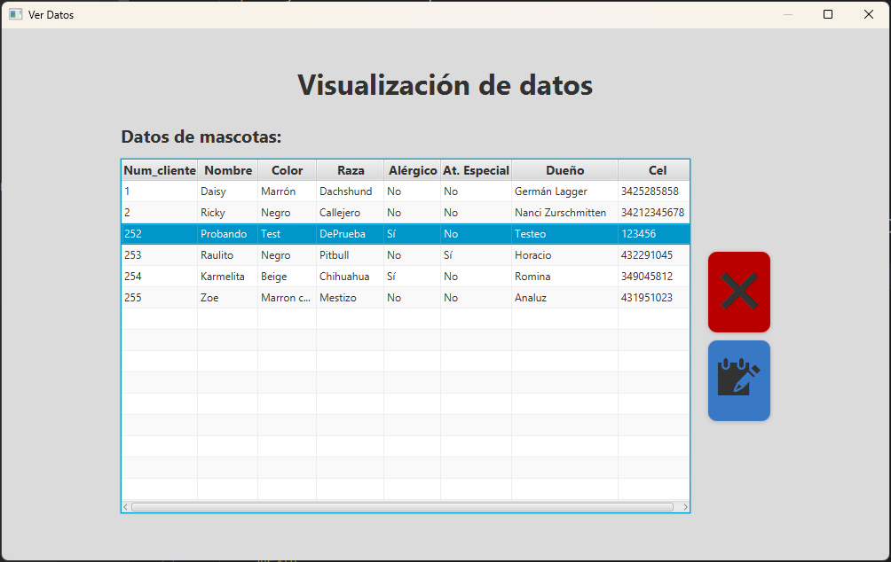
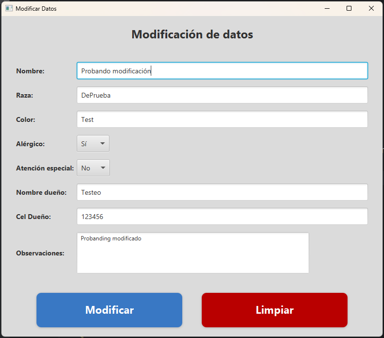

# 🐶 Sistema de Gestión de Mascotas

¡Bienvenido a mi proyecto de gestión de mascotas! Este software permite registrar y administrar información de dueños y sus mascotas.

## 📖 Descripción
Este proyecto fue desarrollado en **Java con JavaFX**, y utiliza **JPA con MySQL** para la gestión de la base de datos.
Nota: es muy simple, hecho para afianzar conocimientos en backend.

## 🛠️ Tecnologías utilizadas
- Java 21
- JavaFX para la interfaz gráfica
- Hibernate y JPA para la persistencia
- MySQL como base de datos

## 🗃️ Modelo de Base de Datos
Este es el **Diagrama ER** del proyecto:



## 📷 Capturas de pantalla
A continuación, algunas imágenes de la aplicación en funcionamiento:






## 🚀 Cómo ejecutar el proyecto
1. Clonar este repositorio:
   ```sh
   git clone https://github.com/Gherex/Veterinaria.git
   ```
2. Importar el proyecto en tu IDE favorito (IntelliJ / Eclipse / NetBeans).
3. Configurar la conexión a la base de datos en `persistence.xml`.
4. Ejecutar la aplicación.

## ✍️ Autor
**Germán Lagger**  
- [GitHub](https://github.com/Gherex)
- [LinkedIn](https://www.linkedin.com/in/germanlagger/)
